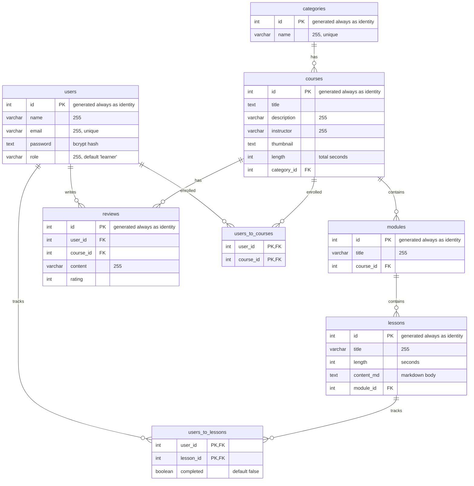
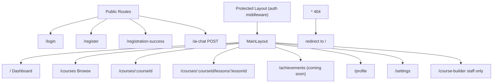
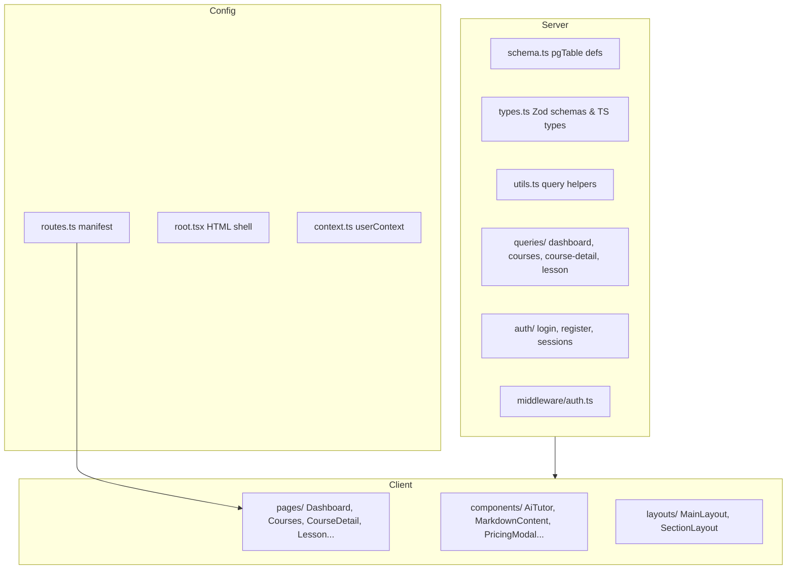

# Architecture

## Database ERD

```mermaid
erDiagram
    users {
        int id PK "generated always as identity"
        varchar name "255"
        varchar email "255, unique"
        text password "bcrypt hash"
        varchar role "255, default 'learner'"
    }

    categories {
        int id PK "generated always as identity"
        varchar name "255, unique"
    }

    courses {
        int id PK "generated always as identity"
        text title
        varchar description "255"
        varchar instructor "255"
        text thumbnail
        int length "total seconds"
        int category_id FK
    }

    modules {
        int id PK "generated always as identity"
        varchar title "255"
        int course_id FK
    }

    lessons {
        int id PK "generated always as identity"
        varchar title "255"
        int length "seconds"
        text content_md "markdown body"
        int module_id FK
    }

    reviews {
        int id PK "generated always as identity"
        int user_id FK
        int course_id FK
        varchar content "255"
        int rating
    }

    users_to_courses {
        int user_id PK, FK
        int course_id PK, FK
    }

    users_to_lessons {
        int user_id PK, FK
        int lesson_id PK, FK
        boolean completed "default false"
    }

    categories ||--o{ courses : has
    courses ||--o{ modules : contains
    modules ||--o{ lessons : contains
    users ||--o{ reviews : writes
    courses ||--o{ reviews : has
    users ||--o{ users_to_courses : enrolled
    courses ||--o{ users_to_courses : enrolled
    users ||--o{ users_to_lessons : tracks
    lessons ||--o{ users_to_lessons : tracks
```

## Route Tree

```mermaid
graph TD
    Public["Public Routes"] --> Login["/login"]
    Public --> Register["/register"]
    Public --> RegisterSuccess["/registration-success"]
    Public --> AiChat["/ai-chat POST"]

    Protected["Protected Layout (auth middleware)"] --> Main["MainLayout"]

    Main --> Dashboard["/ Dashboard"]
    Main --> Courses["/courses Browse"]
    Main --> CourseDetail["/courses/:courseId"]
    Main --> Lesson["/courses/:courseId/lessons/:lessonId"]
    Main --> Achievements["/achievements (coming soon)"]
    Main --> Profile["/profile"]
    Main --> Settings["/settings"]
    Main --> CourseBuilder["/course-builder staff only"]

    Splat["* 404"] --> Redirect["redirect to /"]
```

## File Structure

```mermaid
graph TD
    subgraph Server
        Schema["schema.ts pgTable defs"]
        Types["types.ts Zod schemas & TS types"]
        Utils["utils.ts query helpers"]
        Queries["queries/ dashboard, courses, course-detail, lesson"]
        Auth["auth/ login, register, sessions"]
        Middleware["middleware/auth.ts"]
    end

    subgraph Client
        Pages["pages/ Dashboard, Courses, CourseDetail, Lesson..."]
        Components["components/ AiTutor, MarkdownContent, PricingModal..."]
        Layouts["layouts/ MainLayout, SectionLayout"]
    end

    subgraph Config
        Routes["routes.ts manifest"]
        Root["root.tsx HTML shell"]
        Context["context.ts userContext"]
    end

    Server --> Client
    Routes --> Pages
```
