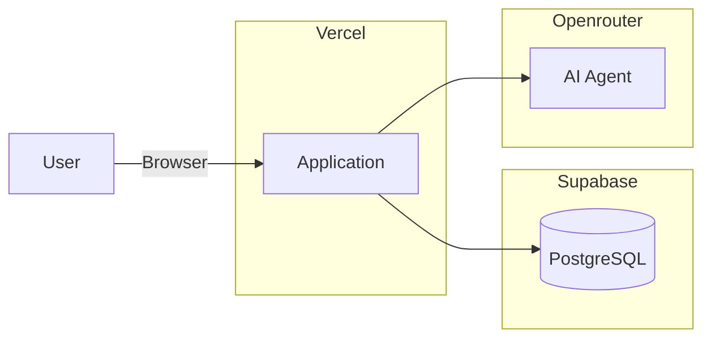

# Web application overview

## Web Framework

Uses React Router in framework mode, with SSR enabled + v8 middlware (recent), this is mainly to make query code [server only](https://reactrouter.com/api/framework-conventions/server-modules#server-directories).

## Database

The source of truth for database schematics is code first, using Drizzle.
