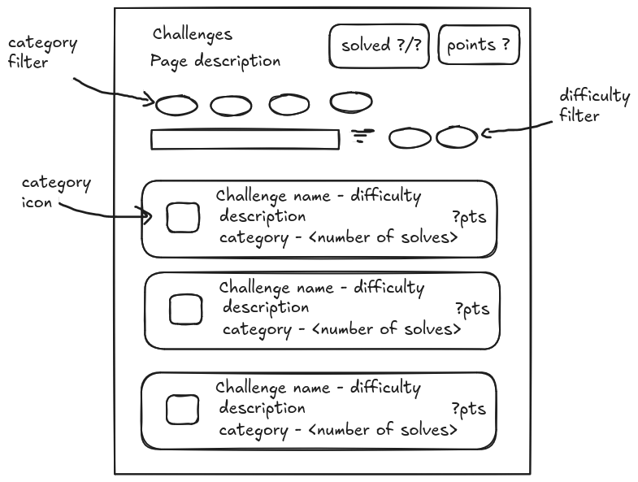
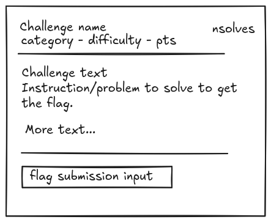

# Challenges

## Requirements

- Users can participate in these challenges.
- Challenge format is problem statement -> flag, ctf like.
- Number of solves for a challenge should be visible.
- Users can track whether they have completed a challenge.
- Challenge categories: web, network, crypto, forensics, binary exploitataion, OSINT.
- Challenge metadata: 
    - difficulty, 
    - achievement points for completing,
    - category,
    - challenge name,
    - description,
    - flag,
    - tags,

- Users can filter by category + difficulty + search by name.
- When a challenge component is clicked display a pop with problem statement + flag submission.

## Sitemap

New paths:

- `/challenges`

## Wireframe

How the `/challenges` page should look not including the main layout.

/// caption
Main page
///

/// caption
Pop up when clicking a challenge
///

## Database

New tables: challenges, tags (id + name)

Relationships:

challenges 1-m user_challenge m-1 users for progress tracking.

Table modifications:

Users will have a new feature: achivement points.

## Progress

- [x] Database.
- [x] Search & filter.
- [x] Popup
