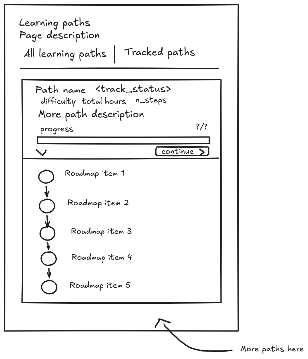

# Learning Paths

## Requirements

A redesign of how learning paths work.

- A learning path is a list that can contain: course, challenges.
- Learning path data:
    - name
    - description
    - time_to_complete
    - tags
    - a roadmap including course & challenge

- Users can start tracking a learning path.
- Users can see what is in a path (roadmap).
- Users that have tracked a learning path can see their progress in the path.
- Have a way to show only tracked paths.

## Database

Existing tables: path, path_course

New tables: user_path (to know if user is tracking a learning path).

Relations:

- path 1-m path_course m-1 course
- user 1-m user_path m-1 path

## Sitemap

Remove: `/paths` and `/paths/:id`.

New: `/learning-path`.

## Wireframe

## Progress

- [x] Database
- [x] UI
- [ ] Progress tracking
