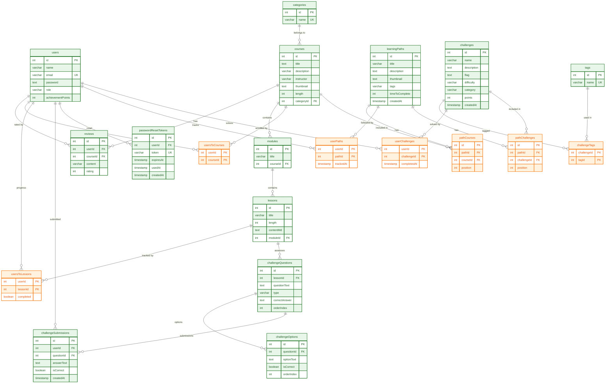

```mermaid
erDiagram
    classDef entity fill:#e8f5e9,stroke:#2e7d32,color:#1b5e20
    classDef junction fill:#fff3e0,stroke:#f57f17,color:#e65100
    %% Green = entity table (own identity). Orange = junction table (many-to-many link).
    users ||--o{ reviews : "rated by"
    users ||--o{ usersToCourses : "enrolled"
    users ||--o{ usersToLessons : "progress"
    users ||--o{ challengeSubmissions : "submitted"
    users ||--o{ passwordResetTokens : "reset"
    users ||--o{ userPaths : "tracks"
    users ||--o{ userChallenges : "solves"

    categories ||--o{ courses : "belongs to"

    courses ||--o{ reviews : "has"
    courses ||--o{ modules : "contains"
    courses ||--o{ usersToCourses : "enrolled by"
    courses ||--o{ pathCourses : "included in"

    modules ||--o{ lessons : "contains"

    lessons ||--o{ usersToLessons : "tracked by"
    lessons ||--o{ challengeQuestions : "assesses"

    challengeQuestions ||--o{ challengeOptions : "options"
    challengeQuestions ||--o{ challengeSubmissions : "submissions"

    learningPaths ||--o{ pathCourses : "has"
    learningPaths ||--o{ userPaths : "followed by"
    learningPaths ||--o{ pathChallenges : "has"

    challenges ||--o{ challengeTags : "tagged"
    challenges ||--o{ userChallenges : "solved by"
    challenges ||--o{ pathChallenges : "included in"

    tags ||--o{ challengeTags : "used in"

    users {
        int id PK
        varchar name
        varchar email UK
        text password
        varchar role
        int achievementPoints
    }

    reviews {
        int id PK
        int userId FK
        int courseId FK
        varchar content
        int rating
    }

    categories {
        int id PK
        varchar name UK
    }

    courses {
        int id PK
        text title
        varchar description
        varchar instructor
        text thumbnail
        int length
        int categoryId FK
    }

    modules {
        int id PK
        varchar title
        int courseId FK
    }

    lessons {
        int id PK
        varchar title
        int length
        text contentMd
        int moduleId FK
    }

    %% junction
    usersToCourses {
        int userId PK
        int courseId PK
    }

    %% junction
    usersToLessons {
        int userId PK
        int lessonId PK
        boolean completed
    }

    challengeQuestions {
        int id PK
        int lessonId FK
        text questionText
        varchar type
        text correctAnswer
        int orderIndex
    }

    challengeOptions {
        int id PK
        int questionId FK
        text optionText
        boolean isCorrect
        int orderIndex
    }

    challengeSubmissions {
        int id PK
        int userId FK
        int questionId FK
        text answerText
        boolean isCorrect
        timestamp createdAt
    }

    learningPaths {
        int id PK
        varchar title
        text description
        text thumbnail
        varchar tags
        int timeToComplete
        timestamp createdAt
    }

    %% junction
    pathCourses {
        int id PK
        int pathId FK
        int courseId FK
        int position
    }

    %% junction
    userPaths {
        int userId PK
        int pathId PK
        timestamp trackedAt
    }

    %% junction
    pathChallenges {
        int id PK
        int pathId FK
        int challengeId FK
        int position
    }

    challenges {
        int id PK
        varchar name
        text description
        text flag
        varchar difficulty
        varchar category
        int points
        timestamp createdAt
    }

    tags {
        int id PK
        varchar name UK
    }

    %% junction
    challengeTags {
        int challengeId PK
        int tagId PK
    }

    %% junction
    userChallenges {
        int userId PK
        int challengeId PK
        timestamp completedAt
    }

    passwordResetTokens {
        int id PK
        int userId FK
        varchar token UK
        timestamp expiresAt
        timestamp usedAt
        timestamp createdAt
    }

    class users,reviews,categories,courses,modules,lessons entity
    class challengeQuestions,challengeOptions,challengeSubmissions entity
    class learningPaths,challenges,tags,passwordResetTokens entity
    class usersToCourses,usersToLessons,userPaths,userChallenges junction
    class challengeTags,pathCourses,pathChallenges junction
```

